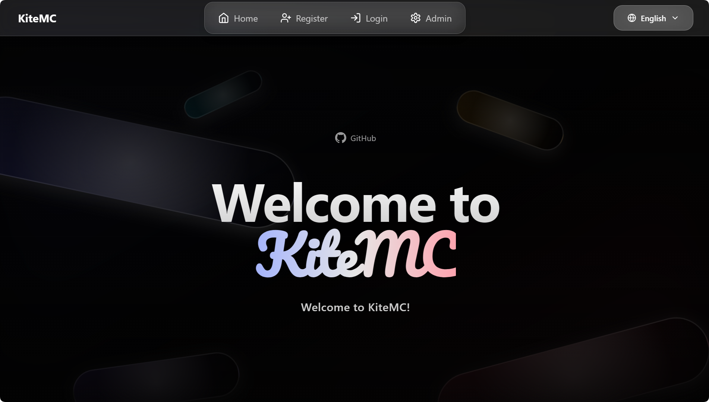
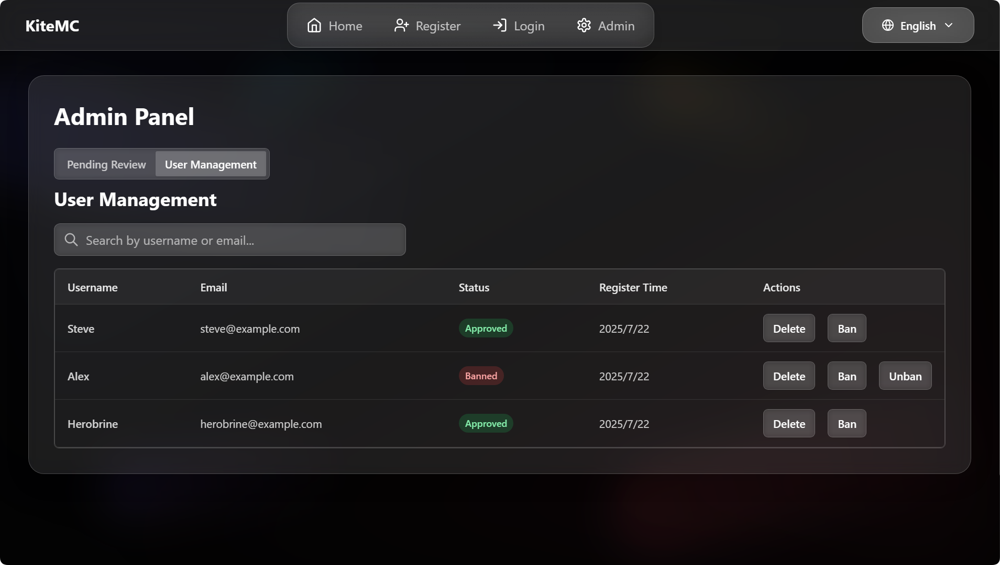

# ✅ VerifyMC

[简体中文](README_zh.md) | English | [📚 Official Documentation](https://kitemc.com/docs/VerifyMC/) | [🚀 Release Notes](release_notes_zh.md)

---

## 🚀 Introduction

**VerifyMC** is a powerful whitelist management plugin for Minecraft servers. It supports web-based registration, auto/manual review, banning, theme switching, AuthMe integration, and high customizability, helping you secure and manage your server community with ease.

---

## 📝 Key Features

1. 🖥️ **Web Registration & Review**: Players can submit whitelist applications via a web page; admins can review, ban, and manage users online.
2. 🔒 **Auto/Manual Review**: Supports both automatic approval and manual admin review to fit different server needs.
3. 🚫 **Ban System**: Ban problematic players to keep your server safe.
4. 🎨 **GlassX Theme**: Beautiful glassmorphism design with smooth animations and modern UI.
5. 📨 **Email Verification & Domain Whitelist**: Integrated SMTP email verification, supports email domain whitelist and alias limit.
6. 🔐 **Self-hosted CAPTCHA**: Built-in graphical CAPTCHA (math/text) - no external services required.
7. 🎮 **Discord Integration**: OAuth2 Discord account linking with optional/required mode.
8. 📋 **Registration Questionnaire**: Customizable questionnaire system with multi-language support.
9. 📧 **User Notifications**: Automatic email notifications for whitelist approval/rejection.
10. 🌐 **Multi-language Support**: Both web UI and plugin messages support English and Chinese.
11. ⚙️ **Highly Customizable**: Set max accounts per email, player ID regex, and more.
12. 🔄 **Auto Update & Backup**: Config files auto-upgrade, with full backup before each update.
13. 🧩 **Flexible Whitelist Modes**: Supports Bukkit native whitelist sync, plugin self-management, and MySQL storage.
14. 💾 **MySQL & Data File Storage**: Easily switch between local file and MySQL storage; supports automatic migration.
15. 📝 **Audit Log Multi-Storage**: Audit logs can be stored in file or MySQL.
16. 🌍 **Custom Internationalization**: Auto-loads any messages_xx.properties file; users can add any language.
17. 🔐 **AuthMe Integration**: Seamless integration with AuthMe plugin for password management and auto-registration.
18. 🎮 **Bedrock Support**: Geyser/Floodgate player prefix support for cross-platform servers.
19. 🔗 **Proxy Support**: BungeeCord/Velocity proxy plugin for network-level whitelist enforcement.
20. 🤖 **LLM Essay Scoring**: AI-powered auto-scoring for text questionnaire answers via DeepSeek/Google, with circuit breaker and concurrency control.
21. 🛠️ **In-Game Commands**: Comprehensive `/vmc` command suite for managing whitelist applications directly in-game.
22. 🛡️ **Enhanced Security**: SHA-256 + Salt password hashing.

---

## 🖼️ Screenshots (GlassX Theme)

### Home Page



### Registration Page


### Admin Panel



---

## 🛠️ Tech Stack

- Java (Bukkit/Spigot/Paper/Folia plugin)
- Frontend: Vue3 + Tailwind CSS (custom themes supported)
- WebSocket real-time communication
- Email service: SMTP

---

## 📦 Installation & Configuration

1. Download the latest `VerifyMC.jar` and place it in your server's `plugins` directory.
2. Start the server to auto-generate config files, then edit `config.yml` as needed (see full example below).
3. Restart the server and visit `http://your_server_ip:8080` to access the admin panel.

### ✅ Recommended Minimum Environment

- Java 17+
- Bukkit/Spigot/Paper/Folia 1.20+
- A public domain with HTTPS enabled (recommended for production)
- SMTP mailbox account (required when using `email` verification)

### ⚡ 5-Minute Quick Start

1. Set `auth_methods: [captcha]` in `config.yml` (fastest setup, no SMTP required).
2. Set `whitelist_mode: plugin` and `web_register_url: https://your-domain.com/`.
3. Register an account via the web page, then grant yourself OP (`op <username>`) to access the admin panel.
4. (Optional) Enable `register.auto_approve: true` for small private servers.
5. Restart the server and open `http://your_server_ip:8080`.

### 🧪 Build from Source

```bash
cd plugin
mvn clean package
```

Output jar: `plugin/target/verifymc-1.7.1.jar`

---

## 💬 Official Community

- **QQ Group**: 1041540576 ([Join](https://qm.qq.com/q/F7zuhZ7Mze))
- **Discord**: [https://discord.gg/TCn9v88V](https://discord.gg/TCn9v88V)

---

> ❤️ If you like this project, please Star, share, and give us feedback!
